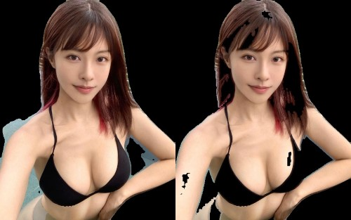
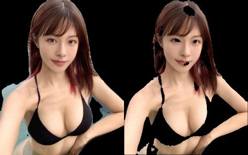
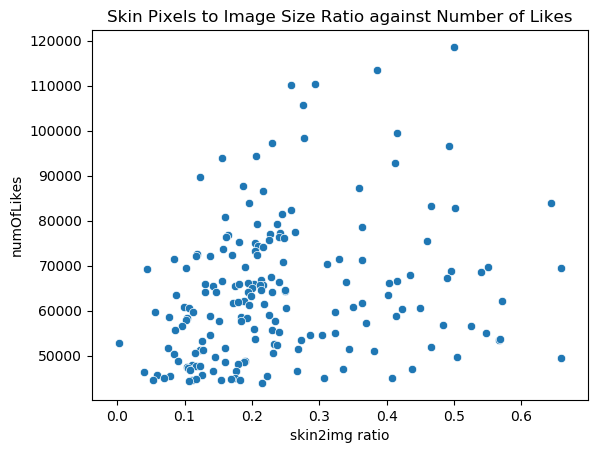

# Data Amoi
1. Test out person+skin segmentation `python skin_analyzer_single.py`
2. Run on a folder of image and get skin to image ratio `python skin_analyzer_folder.py` 
3. Perform EDA `python eda.py`

#### Results
1. Person + Skin Segmentation
<br> Method 1
<br>
<br> Method 2
<br>
2. Results Scatter Plot


#### References
1. [skin detection](https://github.com/Jeanvit/PySkinDetection)

#### Gotchas
1. Inverse normalize + convert2bgr from torch tensor to opencv matrix is non equivalent to direct `cv2.imread`
```python
    input_frame = self.inverse_normalize(self.x, mean=(0.485, 0.456, 0.406), std=(0.229, 0.224, 0.225))
    frame = input_frame[0].permute(1, 2, 0).numpy()
    frame = cv2.cvtColor(frame, cv2.COLOR_RGB2BGR)
```

